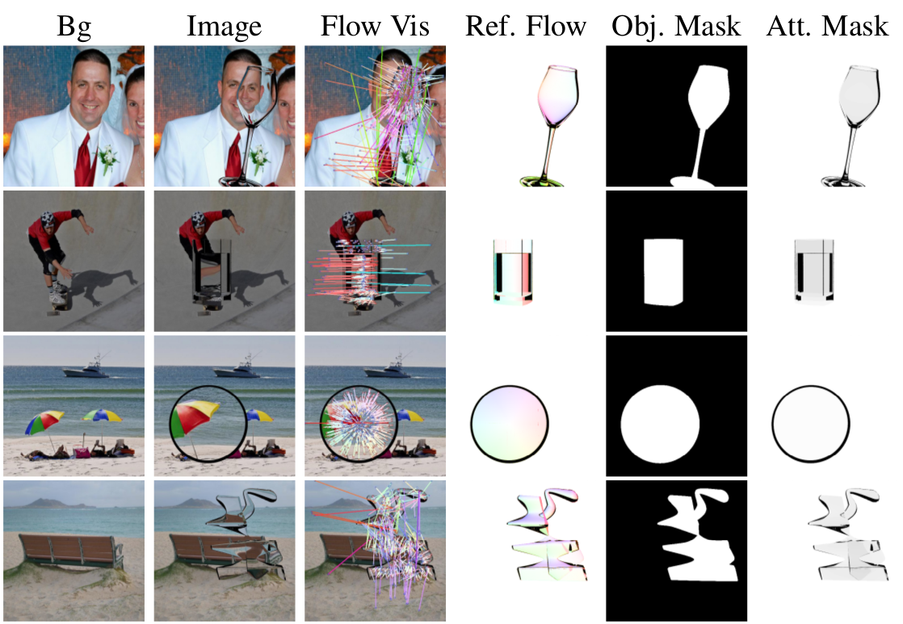
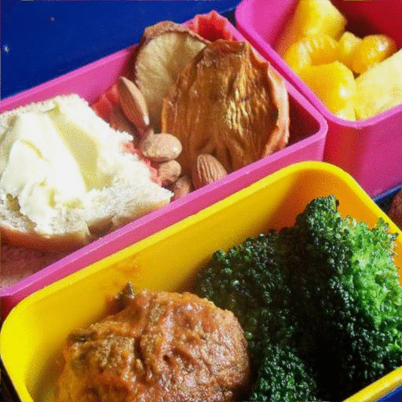

# Data Rendering for Transparent Object Matting
**[Learning Transparent Object Matting from a Single Image, CVPR 2018 (Spotlight)](http://gychen.org/TOM-Net/)**,
<br>
[Guanying Chen](http://www.gychen.org)\*, [Kai Han](http://www.hankai.org/)\*, [Kwan-Yee K. Wong](http://i.cs.hku.hk/~kykwong/)
<br>
(\* indicates equal contribution)

## Introduction
As no off-the-shelf dataset for transparent object matting is available, and it is very tedious and difficult to produce a large real dataset with ground truth object masks, attenuation masks and refractive flow fields, we created a large-scale synthetic dataset by using [POV-Ray](http://www.povray.org/) to render images of synthetic transparent objects.

<p align="center">
     <br>
    
</p>

## Dependencies
- POV-Ray 3.7
- Python 2.7

## Sample Rendering Code 
After installing POV-Ray, type the following command to render a transparent object in front of an image and get the ground truth object mask, attenuation mask and refractive flow field. 
```
sh render.sh
```
We obtained the ground truth refractive flow field of an object by rendering it in front of a sequence of Gray-coded pattern.
